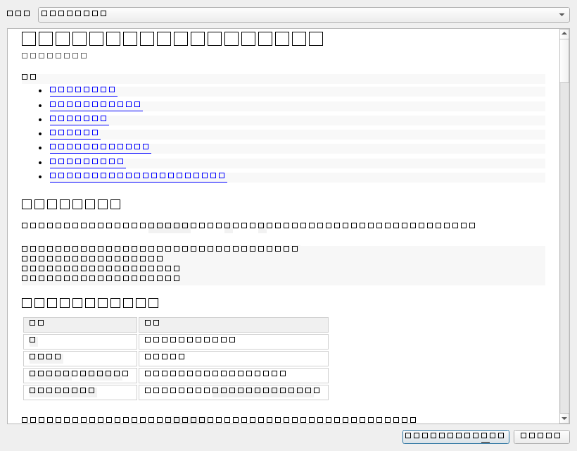

# 界面说明

> 本文描述**当前已实现**的主界面：版面分区、交互契约、以及几条由我定下的规则
> （都已标注，你可以推翻）。
>
> 截图：[`docs/images/ui-main.png`](images/ui-main.png)（填了示例数据、已算出输出的状态）、
> [`docs/images/ui-help.png`](images/ui-help.png)（帮助 → DSL 语法与函数速查）

## 版面

上下两段，中间可拖动分隔（`QSplitter`，不允许拖到折叠）。

```text
┌───────────────────────────────────────────────────────────────┐
│ ＋ 添加列表   每列是一个列表源；表达式里用 $list1$ 引用…        │
│ ┌──────────┐ ┌──────────┐ ┌──────────┐                        │
│ │ list1  × │ │ list2  × │ │ list3  × │   ← 列增多时横向滚动    │
│ │ 报告A    │ │ 1        │ │ …        │                        │
│ │ 报告B    │ │ 2        │ │          │   ← 每列内部竖向滚动    │
│ │ 报告C    │ │ 3        │ │          │                        │
│ │ ＋项 －项 │ │ ＋项 －项 │ │ ＋项 －项 │                        │
│ └──────────┘ └──────────┘ └──────────┘                        │
├───────────────────────────────────────────────────────────────┤
│ [ $list1[i]$-第$list2$版_____________________ ] [   确定   ]   │
│ 计算完成：3 行                                                 │
│ 输出列表                                            共 3 行    │
│ ┌───────────────────────────────────────────────────────────┐ │
│ │ 报告A-第1版                                                │ │
│ │ 报告B-第2版                                                │ │
│ │ 报告C-第3版                                                │ │
│ └───────────────────────────────────────────────────────────┘ │
└───────────────────────────────────────────────────────────────┘
```

### 两层滚动怎么实现的

外层 `QScrollArea`（水平滚动）+ 每列固定宽度 190px：

- 列宽固定 → 容器的最小宽度随列数增长 → 列多了水平滚动条自然出现；
  若让列跟着拉伸，滚动条永远不会出现，"增减列"这个交互就看不出来。
- `widgetResizable(true)` 让容器高度始终等于视口高度 → 每列内部的列表**竖向撑满**并自己滚动。
- 外层禁用竖向滚动条（`ScrollBarAlwaysOff`）——竖向滚动归每列自己管。

## 交互契约

| 操作 | 行为 |
|---|---|
| 「＋ 添加列表」 | 末尾新增一列，名字取 `nextName()` |
| 列标题右侧 × | 删除该列 |
| 双击某项 / 直接敲键 | 就地编辑该项 |
| 「＋ 项」/「－ 项」 | 在末尾加一项 / 删除选中的项（可多选） |
| 表达式框内回车 或 点「确定」 | 求值，结果铺到输出列表 |
| 求值失败 | 输出列表**清空**，输入框下方红字给出原因 |
| 菜单「帮助 → DSL 语法与函数速查」，或按 **F1** | 打开速查表对话框 |
| 菜单「帮助 → 关于」 | 版本与构建信息 |

空表达式时「确定」是禁用的（没什么可算的，别给一个点了没反应的按钮）。

## 帮助：语法与函数速查

菜单「帮助 → DSL 语法与函数速查」，或直接按 **F1**。输入框的占位提示里也写了
「按 F1 查看语法与函数」，所以不用先去找菜单。



内容**不在界面代码里**：它来自 `batchsmith::core::dsl`，与命令行 `bs cheatsheet`
渲染的是同一份数据，界面只负责显示。窗口是非模态的，可以一边看一边在输入框里改表达式。

窗口右上角有「另存为 HTML」，导出的是单文件手册（可用浏览器打开、也能分发给别人）。

包含：模板基本形态、区段里可用的名字（`i` / `rows` / `list1`…）、行数与展开规则、
全部 28 个工具函数（按列表/组合/生成/文本/路径/类型分组）、沙箱里可用与不可用的
Lua 能力、四个容易踩的点，以及 26 条带实际输出的示例。

### 这份帮助为什么不会「说过时的话」

帮助最容易出的问题不是崩溃，而是内容与实现不符 —— 写了个不存在的函数，或者
新加了函数却忘了写进帮助。这类错误靠「写文档时仔细一点」是防不住的。

所以速查表是按**数据**定义的（`src/core/include/batchsmith/core/dsl/cheatsheet.hpp`
里的 `helper_docs()` 与 `cheat_examples()`），渲染文本由数据生成，再由测试遍历数据核对：

| 检查 | 能挡住什么 |
|---|---|
| 文档里的函数名 ⟷ 沙箱实际注册的名字，**双向**比对 | 漏写新 helper、名字写错 —— CI 直接红 |
| 每条示例真的求值一遍，并逐行核对声明的输出 | 改了实现却没改文档 |
| 渲染文本里必须出现每个函数名 | 「数据对、但渲染漏了」 |

写这套测试时它当场抓到了我自己写错的一条示例：`$(i % 2 == 1 and "奇数" or "偶数")$`
声明了 3 行输出，但那条示例没配列表示例数据 ⇒ 实际只出 1 行。这正是它该起的作用。

### 手册形态：HTML 与 CHM

同一份数据能渲染出三种形态，各有各的用途：

| 形态 | 谁用 | 怎么生成 |
|---|---|---|
| 纯文本 | 终端里查（`bs cheatsheet`） | `cheatsheet_text()` |
| **HTML** | 界面的帮助窗口；也是随包分发的单文件手册 | `cheatsheet_html()` |
| **CHM** | Windows 原生帮助（双击即看、带左侧目录树） | `cheatsheet_html()` + `cheatsheet_hhc()` 经 `packaging/make-chm.sh` 编译 |

发布包里三平台都附 HTML 手册，Windows 另外附 CHM。**离线可用、随版本走** ——
不需要联网去查文档，也不会看到与手上版本不符的说明。

生成 CHM 需要 `hhc.exe`，用 `packaging/fetch-hhc.sh` 自动获取（从 HTML Help Workshop
的自解压 CAB 里直接提取，不跑安装器、不改注册表、不需要管理员权限）。
CHM 的左侧目录树由 `cheatsheet_hhc()` 生成 —— 与界面的章节下拉、HTML 里的目录
**同一份数据、同一组锚点**；测试会核对 hhc 的每个跳转目标在 HTML 里真实存在
（"点了跳不过去"这种事没有别的办法能测出来）。

## 三条我定下的规则（可以改，但请先看理由）

### 1. 列编号：已存在的列永不改名，新增时取当前未占用的最小编号

于是删掉 `list1` 再新增，新的还是 `list1`；而 `list2` 永远叫 `list2`。

反过来（删一列就把后面的全部重编号）看似整齐，但后果是**表达式里的引用会静默指向另一个列表**——
批量操作的语义会悄悄变掉，而且不会有任何报错。这条在 `ListSourcePanel::nextName()` 上方
写了注释，别无声改掉。

如果你更想要"严格按创建顺序递增、不复用编号"，改 `nextName()` 一处即可。

### 2. 表达式由 Lua 引擎求值（0.3.0 起）

界面点「确定」调的是 `batchsmith::core::dsl::evaluate_template` —— 正式的编译器 + 沙箱实现，
不再是 0.2.0 那个临时代码。也就是说**界面上能用的就是完整 DSL**：`$list1[i]$`、`$i$`/`$rows$`、
`#list1`、`$matrix(...)$`、全部 helper、沙箱四重限制，与 `bs eval` 完全同一套语义。

界面对求值结果的两种处理：

- **成功** → 输出列表铺开行，并显示「计算完成：N 行」；
- **失败** → 输出列表**清空**，输入框下方红字给出原因（如 `区段 `$list9$` 出错：没有名为 list9 的列表（现有：list1）`）。

需要留意的一条语义（技术方案 §3.2）：**模板若不用行上下文（不读 `i` / `rows`）就只求值一次**。
所以 `$matrix(list1,list2,'-')$` 出 9 行而不是 27 行；想要逐行对应就写 `$list1[i]$`。

### 3. 输出列表只读，且空结果有明确提示

"没算过"与"算出来是空"是两件事，在批量操作里差别很大，界面上不能都表现为一片空白。

## 截图怎么重新生成

不需要桌面会话、不需要手动点，用测试目标里那个开关即可（`tests/gui/ui_shot.cpp`）：

```bash
QT_QPA_PLATFORM=offscreen BATCHSMITH_UI_SHOT=/tmp/ui.png ./build/ci/bin/batchsmith_gui_tests
```

它构造主窗口、填入示例数据、跑一次 `$list1[i]$-第$list2$版`、然后把窗口渲染成 PNG。
放在测试目标而不是产品代码里，是为了不给发布产物加任何只服务于截图的开关。

帮助对话框另存一张（内容较长，单独渲染才看得清排版）：

```bash
QT_QPA_PLATFORM=offscreen BATCHSMITH_HELP_SHOT=/tmp/help.png ./build/ci/bin/batchsmith_gui_tests
```

## 测试覆盖

| 目标 | 框架 | 用例 | 断言 | 说明 |
|---|---|---|---|---|
| `batchsmith_tests` | doctest | 71 | 740 | core：扫描器、编译器、引擎、沙箱对抗性测试、速查表交叉校验、自然排序、版本 |
| `batchsmith_gui_tests` | doctest + `QT_QPA_PLATFORM=offscreen` | 14 | 125 | 主窗口装配、增删列与编号、回车/按钮等价、报错清空输出、帮助对话框与 F1、触发动作弹窗（端到端）、输入提示 |

GUI 测试刻意**按对象名找控件**而不是给主窗口加一堆 getter：界面内部怎么组织不影响测试，
而对象名本来也是 Qt 里调试与自动化该有的东西。这也正是把界面拆成
`batchsmith_gui` 静态库（而不是一个 `add_executable` 打包到底）的原因——不拆就没法链接进测试。
